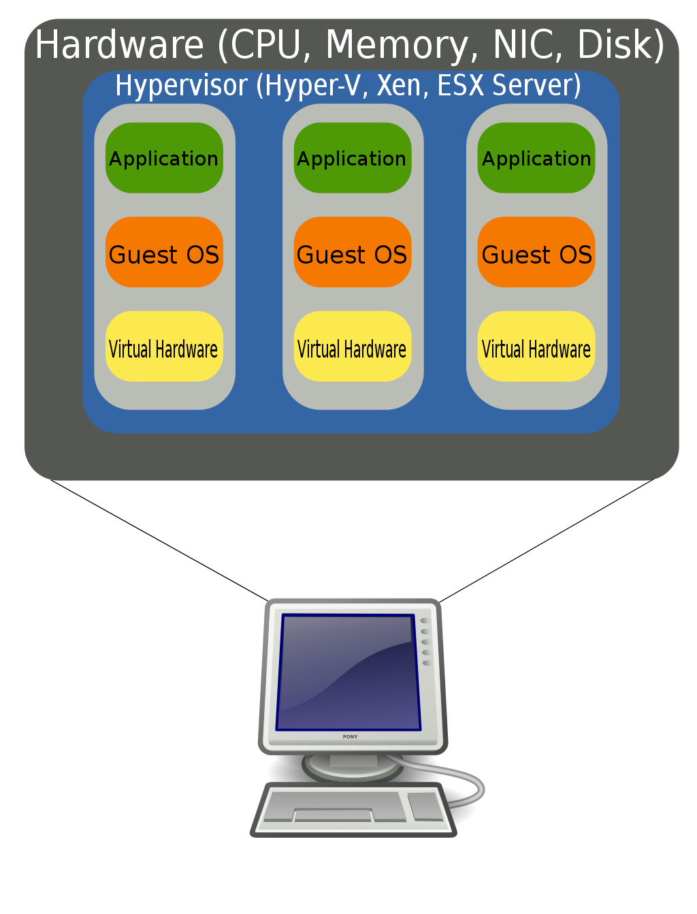

In the early days of computing, computers were called *mainframes* and filled
a big room. To let the perform computations, you have to feed them punch-cards,
so most of the time it's users were busy sitting behind a desk punching holes
in pieces of paper. When they were done, they would leave the punch cards in
a mailbox, and after some time, receive the results of the computation (if no
error occurred) printed on paper from another mailbox. Since these computers
were very large and expensive, many different users 

<figure>
    
    <figcaption>IBM 704 mainframe (1964).
     <a href="https://commons.wikimedia.org/wiki/File:IBM_704_mainframe.gif" target="_blank">Courtesy of Lawrence Livermore National Laboratory</a>
    </figcaption>
</figure>

For the users of these computers, the *computer terminal* with a screen and
keyboard was a very welcome innovation. As computer were still expensive,
multiple terminals were connected to the same mainframe. All data was stored
and computations happened on the mainframe, with the terminals only serving
as endpoints providing a keyboard instead of punch cards and a screen instead
of text printed on paper. In modern day computing, we still see the word 
*terminal* appear, but usually as an application that can be used to interact
with a computer system.

<figure>
    
    <figcaption>DEC VT100 terminal (1978).
    <a href="https://commons.wikimedia.org/wiki/File:DEC_VT100_terminal.jpg" target="_blank">Courtesy of Jason Scott (CC BY 2.0)</a>
    </figcaption>
</figure>

By the 1980's computers got small enough to sit on a desk, and *personal computers*
emerged, machines not shared by many users but dedicated to a single person or family.
For some decades, this was a common way people used computers. Even though big companies
still used centralized main-frames for important databases, for most people networking
was still expensive and most computers were used in a stand alone way and data was 
most commonly transferred between computers using physical data carriers.

<figure>
    
    <figcaption>40 Years of Removable Storage, an important way to transport data between computers.
        <a href="https://commons.wikimedia.org/wiki/File:Forty_years_of_Removable_Storage.jpg" target="_blank">Courtesy of avaragado (CC BY 2.0)</a>
    </figcaption>
</figure>

In the first decade of the 2000's, increasing access to (wireless) internet and the introduction of smart phones
resulted in an explosion of more centralized services, such as web-mail, maps and photo albums. This made it
easier for users to access their data and the same service from different computing devices, without the need
to transfer data between devices using physical storage. An added advantage of this *centralization* is that
you have a single truth. If you have two different versions with on two different devices, it can be difficult
to know which one is the best one, but with a centralized approach you have a *single truth*.

The advantage of this kind of centralization is that it becomes possible to *outsource* the configuration and
management of computers and software. While it is possible to set up your own private mail service, doing
so takes a lot of effort, so most individuals outsource this to Google, Microsoft or their Internet Service Provider.
The ability to outsource complicated IT management tasks to companies who have a lot more knowledge and
experience is potentially very attractive to many (smaller) companies, as they can avoid having to set up their own
IT department and focus on their core business competencies.

While access to the internet become more and more widespread, computers became so powerful that their resources
were *mostly idle* during daily office work, and operating systems were improved to be able to run many different
programs in parallel. This innovation was taken to the extreme by the development of *virtualization* software
which made it possible to let a big and powerful computer behave as if it were a number of smaller virtual computers,
allocating computational resources to the virtual computer that requires it the most. This provided significant
economy of scale benefits, in particular to companies that already had big data-centers full with computers providing
services to internet users. 

<figure>
    
    <figcaption>Diagram showing an example of hardware virtualization: one physical computer behaves
    as if it were three virtual computers.
    </figcaption>
</figure>

Arguably, the advantages offered by *centralization*, the easy of use thanks to *outsourcing* and the *scalability*
offered by *virtualization*, are all important drivers of the success of the cloud. In the last decade, a plethora
of cloud services offered by all kinds of businesses has emerged. As of 2021, major cloud service providers such as
Amazon Web Services and Microsoft Azure offer hundreds of different cloud services to their customers. To make sense
of this scala of services, they are often categorized by *Something-as-a-Service* labels. Full featured, ready to use
services like *Google Docs*, *Office 365* or *Overleaf* are often denoted by the *Software-as-a-Service* label,
abbreviated to SaaS.

In this workshop, we focus on the other end of the spectrum, often denoted as *Infrastructure-as-a-Service* (IaaS).
An important part of this is the ability to rent a (virtualized) computer running in the cloud with little effort,
paying only for the time the computer is running. It is like renting a server that you can use for whatever purpose
you see fit, paying only for it while it is turned on. This particular type of service is typically called a 
*Virtual Machine* (VM) or *Virtual Private Server* (VPS), and is offered by most cloud providers. Many of the other
cloud services are built on top of this type of service, and typically focus on a more specific task such as Data Science,
Machine Learning, File Storage, Databases, Web Services, etcetera. Many of these types of services consist of a VPS with
some additional software pre-configured to facilitate a particular task, i.e. a Data Science cloud service cloud consist of a VPS that comes
with R and Python and the most popular packages pre-installed, saving you the hassle of having to install them
yourself.

> ## Some cloud providers 
> Below is a list of some well-known cloud providers and useful services offered by them.
>
> * [Microsoft Azure](https://azure.microsoft.com) offers [Virtual Machines](https://azure.microsoft.com/en-us/services/virtual-machines/) and has a [free $100 trial for students](https://azure.microsoft.com/en-us/free/students/)
> * [Amazon Web Services](https://aws.amazon.com) offers virtual machines under the name Elastic Compute Cloud, abbreviated to [EC2](https://aws.amazon.com/ec2/). They have a [free tier](https://aws.amazon.com/free/) that provides the option to run virtual machines with few resources for up to 750 hours.
> * [Google Cloud](https://cloud.google.com/) offers virtual machines under the name [Compute Engine](https://cloud.google.com/compute/) and provides $300 free credits to new customers.
> * [IBM Cloud](https://www.ibm.com/cloud) offers server under the name [IBM Cloud Infrastructure](https://www.ibm.com/cloud/infrastructure). They may offer discounts or free services through their [Academic Initiative Program](https://www.ibm.com/academic/technology/cloud).
> * [Alibaba Cloud](https://www.alibabacloud.com) is a major cloud provider in China
> 
> There are many other smaller providers that provide VPS or IaaS kind of services.
> Furthermore, other types of cloud services that can be interesting to consider are:
>
> * [Google Colab](https://colab.research.google.com) is a specialized cloud service that focuses on writing and running Jupyter notebooks for free, including access to GPU's.
> * [RStudio Cloud](https://rstudio.cloud/) is a specialized service for running RStudio and R on a cloud instance, which can be used from your browser.
{: .callout}



