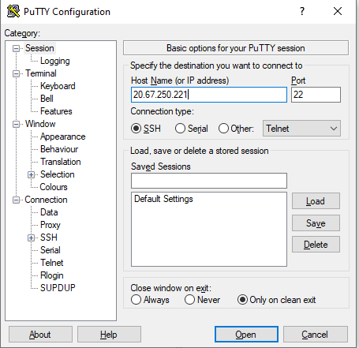
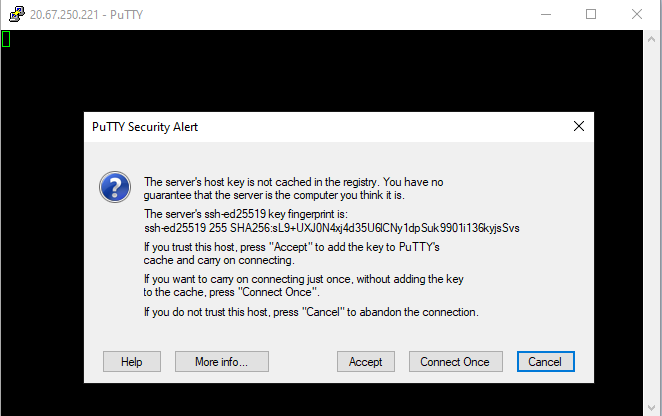
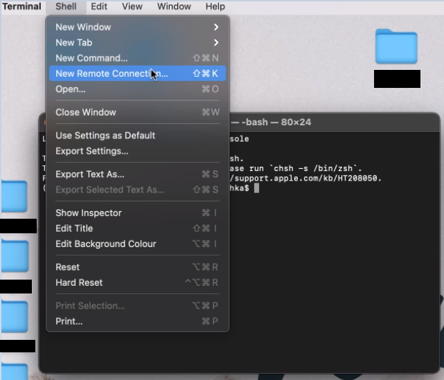
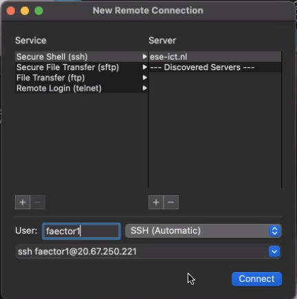
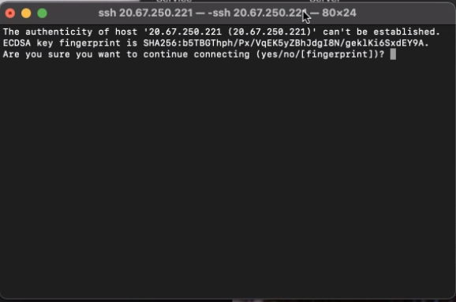
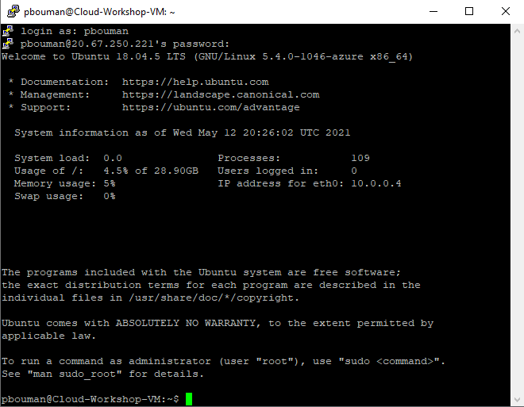

## Opening a Terminal

Connecting to a Linux system is most often done through a protocol known as "SSH"
(Secure Shell). On Mac and Linux, you typically use SSH through a terminal, an
application that offers a similar experience to the old-fashioned experience of
sitting behind a real terminal, with the advantage that it is very easy to have
multiple terminal windows open at the same time.

On Windows, the easiest option is to install and use Putty from
[https://www.chiark.greenend.org.uk/~sgtatham/putty/latest.html](https://www.chiark.greenend.org.uk/~sgtatham/putty/latest.html). 
(you probably want the 64-bit x86 installer), which is purely an SSH client,
intended to connect to remote computers, and which does not offer the option
to work with the shell locally. Alternatively, you can use
a Linux terminal from windows using the [Window Subsystem for Linux](https://docs.microsoft.com/en-us/windows/wsl/)
or the [Git Bash shell](https://gitforwindows.org/) that comes with
Git for Windows, in which case the process is very similar to the process
for Linux users.

### Mac

Macs have had a terminal built in since the first version of OS X since it is
built on a UNIX-like operating system, leveraging many parts from BSD (Berkeley
Software Distribution). The terminal can be quickly opened through the use of
the Searchlight tool. Hold down the command key and press the spacebar. In the
search bar that shows up type "terminal", choose the terminal app from the list
of results (it will look like a tiny, black computer screen) and you will be
presented with a terminal window. Alternatively, you can find Terminal under
"Utilities" in the Applications menu.

### Linux

There are many different versions (aka "flavours") of Linux and how to open a
terminal window can change between flavours. Fortunately most Linux users
already know how to open a terminal window since it is a common part of the
workflow for Linux users. If this is something that you do not know how to do
then a quick search on the Internet for "how to open a terminal window in" with
your particular Linux flavour appended to the end should quickly give you the
directions you need.

## Logging onto the system

With all of this in mind, let's connect to a remote HPC system. In this
workshop, we will connect to the cloud system. For this, you need the system's
IP address or hostname, which you either can get from the virtual machine's landing page
in the portal of your cloud provider. During the workshop, your instructor will
provide you with this information. Additionally, you need a user name and password
to be able to login to the remote computer.

> ## Entering a password
>
> When you are entering a password in a terminal,
> **no output is displayed**. If you are used to password prompts
> that show dots or stars indicated you typed something, this
> can be a bit unsettling, but it is perfectly normal. Just press
> <kbd>&crarr;</kbd> when you are done, and you should get a message
> indicating if your password is correct.
>
> One reason it works this way is that less information is leaked:
> someone who peeks at your screen while you enter your password
> will not even know how long your password is!
{: .caution }

Go to the section that fits your operating system:

* <a href="#windows">Windows</a>
* <a href="#macos">Mac OS</a>
* <a href="#linux">Linux / Existing bash terminal</a>


### Log in using Windows and Putty <a name="windows"></a>

When you start up Putty, the first thing it will ask you for is a
*Host name* or *IP address*. At this point you should have received
this information about the computer you want to connect to, and fill
it in.

<figure>
    
    <figcaption>The starting screen of PuTTY can be used to set up an ssh-connectiong to a remote computer</figcaption>
</figure>

To get started, everything you need to do is fill in the hostname or 
ip address in the designated field, and click *Open*. If it is the first time of you connecting to this server, it will show the following
popup

<figure>
    
    <figcaption>PuTTY prompt to trust the server's security certificate.</figcaption>
</figure>

Accept this certificate.

> ## Server certificate
>
> The first time you connect to a new computer, your ssh client checks 
> the identity of the server based on it's certificate.
> Typically, your client will store this certificate so the next time
> you connect, it does not have to ask you about the certificate any
> more. If the certificate of the server would change,
> that would mean that you are either communicating with a different 
> virtual machine than you were before, or that you reinstalled the 
> operating on the server so it generated a new certificate.
{: .callout }

If all went well, you should be logged in now. <a href="#success">Continue to the *success* part of this episode</a>.

### Log in using the Mac OS terminal application <a name="macos"></a>

Once you have started the Terminal application, you can either type in
the `ssh` command. If you prefer that, read the <a href="#terminal">Linux section</a> of this episode.

To set up a remote connecting with a GUI dialog, choose the
*New Remote Connection...* option in the *Shell* menu of the Terminal
application, as can be seen below:

<figure>
    
    <figcaption>Set up a remote connecting with the Mac OS terminal application</figcaption>
</figure>

You should then click *Secure Shell (ssh) and click the + button to add a server. Add the IP address of the server you want to connect to, and fill in the user name you want to use to connect to the server. You should be able to see that a command is constructed that looks something like `ssh username@the.server.address`, as in the example below:

<figure>
    
    <figcaption>Setting up a remote connecting with an address and user name in the Mac OS terminal application.</figcaption>
</figure>

Finally, the first time you do this you will see a prompt similar to the prompt below asking you to add a certificate for the server you connect to. **Accept the certificate by typing** `yes` and pressing <kbd>&crarr;</kbd>.

<figure>
    
    <figcaption>Prompt to accept a host fingerprint/certificate the first time you connect to a new server</figcaption>
</figure>

Finally, you should enter your password. Remember that anything you enter will remain invisible (not dots or stars are shown). You can use a right-click to enter a password. Once you have entered the password, press <kbd>&crarr;</kbd> to enter it.

If all went well, you should be logged in now. <a href="#success">Continue to the *success* part of this episode</a>.

### Log in from a local bash terminal (Linux) <a name="linux"></a>

SSH allows us to connect to UNIX computers remotely, and use them as if they
were our own. The general syntax of the connection command follows the format

```
ssh yourUsername@the.server.address
```
{: .language-bash}

The first time you connect to a new computer, you may have to accept the
security certificate of the server. **Accept the certificate by typing** `yes` and pressing <kbd>&crarr;</kbd>. Typically, your client will thenstore this
certificate so the next time you connect, it does not have to ask you about
the certificate any more. If the certificate of the server would change,
that would mean that you are either communicating with a different virtual machine
than you were before, or that you reinstalled the operating on the server
so it generated a new certificate.

### When successfully logged in <a name="success"></a>

If you've connected successfully, you should see a welcome message.
On a basic Azure Ubuntu virtual machine, the message looks something
as follows: 

<figure>
    
    <figcaption>Example of a succesful login with a typical welcome message from Ubuntu</figcaption>
</figure>

It may contain some more private information (such as the
last IP address that connected with your user account). Note that at the end it shows a prompt:

```
username@machine-name:~$
```
{: .output }

The `$` indicates that the server is waiting for you to type a new command for it to execute. You're connected and ready to go!


> ## Transferring files to and from the remote computer
>
> Now that you have connected to the remote computer, you may wonder how
> you can transfer files to and from the remote computer, including your
> own programs, data files, and results of experiments that ran on the
> virtual machine. This can typically be done using a SFTP client and
> the same credentials you use to login with SSH (SFTP stands for 
> SSH File Transfer Protocol). It can be very helpful to use a
> graphical client for this, and some good free options are
> [WinSCP](https://winscp.net) for Windows users, and 
> [FileZilla](https://filezilla-project.org/) for all platforms.
> If you struggle connecting, make sure that the SFTP protocol is
> selected.
{: .callout }