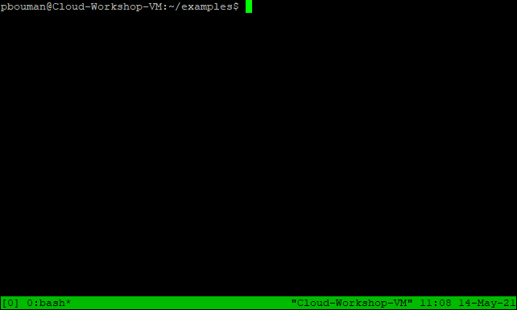
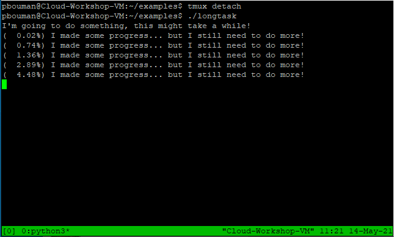

> ## Example code
>
> In this episode you will work with example code. During the
> workshop your instructor will have set up a user account
> that comes with the example code already provided.
> If you are not participating in the workshop, you can 
> [download an archive](../files/userbase.tar.gz)
> with all the files assumed to be present during this episode.
{: .prereq }

A computer running in the cloud can be a handy system to run
a long running computation. Unfortunately, once your ssh client
disconnect, the programs that are currently running in your shell
session are terminated. In this episode we discuss how you can schedule
programs to be run at a given time. This can be handy if, for example,
you want to do some data scraping or monitor tasks. Furthermore, we
consider how you can safely disconnect to the remote computer while
your computations are running.

## Periodic execution of programs

For some tasks, such as scraping data from a website, it can
be useful if the virtual machines runs it at certain times
without you starting it. Unix systems have a well know tool
for this called `cron`, derived from the Greek word for time
(Chronos). Every user has a so called `crontab`, a table with
times and commands for `cron` to execute. This is basically
a text file where each line first has fields separated by
spaces indicating when to run a given task, followed by the
command to run. The five fields are as follows:

1. Which minute (0 - 59) should the command run
2. Which hour (0 - 23) should the command run
3. Which day of the month (1 - 31) should the command run
4. Which month (1 - 12) should the command run
5. Which day of the week (0 - 6), where 0 is Sunday and 6 is Saturday, should the command run.

For each field, we can also use a wildcard `*` to indicate
that it should be executed at every moment, rather than a
particular moment. We can also list multiple times by using
comma's, so `1,2,3` would mean only at time units `1`, `2`
or `3`. Finally, it is also possible to use something like
`*/5` to indicate that intervals of 5 time units should be
considered (of course, different numbers than 5 can be used).

> ## Some examples of crontab lines
>
> ```
> # Runs myCommand at 12:00 on the first day of each month
> 0 12 1 * * myCommand
> # Runs myCommand at 13:15, 13:30, 13:45, 15:15, 15:30 and 15:45 every day
> 15,30,45 13,15 * * * myCommand
> # Runs myCommand every five minutes
> */5 * * * * myCommand
> ```
{: .callout }

Let's experiment with this. If we run

```
$ date
```
{: .language-bash }

This will print the current date and time. Using the command

```
$ date >> ~/dates.txt
```
{: .language-bash }

this data will be appended to the file `~/dates.txt`. We will
use this command to easily check if the cron tab is working.
We can edit our crontab by running

```
$ crontab -e
```
{: language-bash}

If you get asked which editor to use, it is easiest to choose `nano`.
Then, at the bottom of the file add a new line:

```
*/3 * * * * date >> ~/dates.txt
```

Make sure you add a newline, so the last line in the file is empty!
Save the file with (with <kbd>Ctrl</kbd>+<kbd>O</kbd>) and exit 
`nano` (with <kbd>Ctrl</kbd>+<kbd>X</kbd>).
If all goes well, you will see:
```
crontab: installing new crontab
```
{: .output }

Great! Now wait for some time and see if new data appears in
the file `~/dates.txt`, for example by running `cat ~/dates.txt`
every once in a while. 

If at some point in time you want to disable the scheduled task,
you can rerun

```
$ crontab -e
```
{: .language-bash }

And either add a `#` at the start of the line we created to
make it a comment, or just remove it. Save the updated cron
tab to let it take effect.

> ## Crontab Generator
>
> If you find it difficult to remember the syntax of the `crontab`,
> there are also websites that can help you generate the required
> line in a more user friendly way. For example, the site
> [Crontab Generator](https://crontab-generator.org/) can be used
> for this. This can make life a bit easier.
{: .callout }

## Working with long running tasks

Sometimes computational experiments take a long time to run. 
If you start an experiment on the command line, the running program
is called a *process*. When you normally run a program from the shell,
the created process will be a *child* of the shell process you are 
currently working in. If you disconnect to the server, this shell
process will be terminated, and so will all it's child processes.
As a consequence, your long running experiments will be stopped once
you disconnect.

To simulate the situation where we have a long running experiment,
the program `~/examples/longtask` will run for five minutes (but to
keep the server usuable for other workshop participants, it will not
perform any computations). Feel free to try running it:

```
$ cd ~/examples
$ ./longtask
```
{: .language-bash }

You will see that it keeps running. You can interrupt it by pressing
<kbd>Ctrl</kbd> + <kbd>C</kbd> on your keyboard, or by disconnecting your
ssh client (closing the window typically does the trick).

Let's try to keep this `longtask` running, even if we disconnect.
One way is to create a virtual terminal session that keeps running,
even if we disconnect from it. One program that can provide us with
that is `tmux`, which stands for *terminal multiplexer*.

> ## Virtual Machines vs Computer Clusters
>
> We will now learn how to use `tmux` to run long jobs on our cluster.
> By using `tmux`, we run the computations directly on the computer we
> connect to. For our own virtual machine running in the cloud, this
> is a fine solution.
>
> Scientific Super Computer Clusters, such as the SurfSARA clusters in the
> Netherlands work differently: they have a very large
> number of computers and work with a job queue to distribute the tasks
> over all the computers in the cluster. You connect via `ssh` to a
> computer from which you submit your jobs to the job queue,
> but you are not supposed to directly run your jobs on the computer you
> connect to. If you are using a super computer, you should probably
> check in the documentation how you can submit jobs to run.
{: .callout }

Now let's use `tmux` to create a persistent terminal session. A useful
command to check if you currently have created any such session is

```
$ tmux ls
```
{: .language-bash }

If no sessions are running, it will print something like:

```
no server running on /tmp/tmux-1000/default
```
{: .output }

Now let's create a session by running:

```
$ tmux
```
{: .language-bash }

If everything works out, we should see something that looks like the following
figure.

<figure>
    
    <figcaption>A newly started tmux session</figcaption>
</figure>

This is now a terminal session that also works with bash, but that will persist
even if we disconnect from the server. Quite handy!

> ## Sessions keep active only while the machine keeps running
>
> Even though the tmux session keeps running when we disconnect our ssh client,
> events such as rebooting or shutting down the virtual machine can still 
> terminate the sessions. 
{: .caution }

Now that we are inside the tmux session, we switch back to our original shell
session by doing 

```
$ tmux detach
```
{: .language-bash }

Which should take us back to our original shell session with the message

```
[detached (from session 0)]
```
{: .output }

This means there is still a tmux session named 0 running. Let's see if
we can find it by running

```
$ tmux ls
```
{: .language-bash }

which would print something like

```
0: 1 windows (created Fri May 14 11:08:19 2021) [80x23]
```
{: .output}

Let's try to get back into this session. We can do so with the
command

```
$ tmux attach -t 0
```
{: .language-bash }

Here the `-t` argument indicates the name of the session we want
to return to. In this case, the name of that session is `0`.
Now that we have reconnected to this session, let's try to run
the `longtask` program in it.

```
$ ./longtask
```
{: .language-bash }

Now we will see something similar to the following:

<figure>
    
    <figcaption>The tmux session running the long task</figcaption>
</figure>

If we now disconnect our ssh client, we can later reconnect to the
session running tmux. However, while it is running we can not type
`tmux detach`. Fortunately, there is also a keyboard shortcut that
can be used to detach from the session without typing that command.
Keyboard commands for `tmux` always consist of two steps.
First you press <kbd>Ctrl</kbd> + <kbd>B</kbd> at the same time
(be careful not to press C accidentally!). After you press these
keys together and release them, you can give `tmux` a command.
Press <kbd>D</kbd> and you will return to your original shell,
while the long task keeps running in your tmux session named `0`.
Feel free to check this by doing `tmux attach -t 0`.

Once you are done with a tmux session, you can close it by typing
```
$ exit
```
{: .bash-language }

> ## The `exit` command closes the session
>
> Be aware that running `exit` in your original ssh session will
> disconnect you!
{: .caution }

### Managing Multiple Sessions

If so desired we can easily create multiple `tmux` sessions in
which we run different computations. Everytime we run `tmux`,
a new session is created, with the first second being called `0`,
the second session `1`, the third `2` etcetera.
It may be helpful to give more memorable names to our sessions
than `0` and `1`. We may do so by typing

```
$ tmux new -s coolexperiment
```
{: .language-bash }

which created a new session with the name `coolexperiment`.
Of course, you are free to use any name you like.
Now when you want to attach to this session (after de-attaching)
you can use 

```
$ tmux attach -t coolexperiment
```
{: .language-bash }

You can make multiple sessions in which you run multiple computations
in parallel this way, and you can easily switch between them using
`tmux` and the corresponding commands.

> ## Sessions do not clean up automatically
>
> One convenience offered by the fact that your regular shells stops 
> as soon as you disconnect your ssh client, is that you do not have
> to worry that your system becomes cluttered with many different
> shell sessions it has to keep in memory. In a sense, it is an
> automatic cleanup facility.
>
> When you use `tmux` sessions, these are not automatically cleaned
> up. That means you have to use `exit` within those sessions to end
> them yourself, or use `tmux kill-session -t session_name` to end it.
> You can use `tmux ls` to check which sessions are currently running. 
{: .caution }

When you know how to create new sessions using `tmux` and attach
and detach from them, you know everything you need to run multiple
computations in parallel on your cloud machine. However, `tmux`
offers even more flexibility: you can arrange multiple sessions
side by side on the same terminal, and there are also key
combinations to quickly switch between them. You can do an
internet search from some [tmux tutorials](https://duckduckgo.com/?q=tmux+tutorial)
and if you forget thing, it can be handy to have a 
[tmux cheatsheet](https://tmuxcheatsheet.com/) ready.


### Checking resource usage

Now that you know how you can create multiple session to run all
kinds of computations in parallel, there is also a danger that you
overload the system. Depending on how many CPU's and memory your
virtual machine has, and the amount of resources consumed by the
applications you run, it can be the case that you manage to slow
the system down so much that it becomes unresponsive. Even worse:
your experiments may run slower if you overload the capacity by
running too many experiments in parallel, compare to running them
sequentially.

It is thus useful to be able to keep an eye on system resource
consumption, similarly to what you can do with the *Task Manager*
and *Resource Monitor* on Windows, or what the *Activity Monitor*
can do on Mac OS. There are a number of very similar utilities
on Unix systems, the most user friendly one being `htop`.
Let's try to run it:

```
$ htop
```
{: .language-bash }

It will show you something as follows:

<figure>
    
    <figcaption>The htop process manager showing a list of running processes.</figcaption>
</figure>

At the top you can see which percentage of the CPU is used;
in the example this is a very low percentage. Underneath you
see the memory usage. Furthermore, you see a list of processes.
Interestingly, `htop` support the mouse. If you click on the
`MEM%`, you will see that the processes are being sorted by
memory consumption, whereas click on `CPU%` will sort them
by CPU consumption. If you click `F10Quit` you will close
the program (alternatively you can press F10 on the keyboard).

Note that if a computer has multiples cores/cpu, unix typically
counts each CPU as 100%. So on a four core system, 200% CPU
usage indicates that half of the cores is being used. Helpfully,
`htop` also clearly shows multiple CPU if they exist. Be aware
though that on some machines, hyperthreading may show twice
as many cores as there are available. Read the specification
of the machine you are using if you are unsure!

Finally, you can also click on a process (`htop` will highlight)
the line you click on, and force that program to stop, by
pressing <kbd>F9</kbd> or clicking `F9Kill` in the bottom.
Note that unless you run `htop` as a super user, you will
only be able to stop your own processes this way, not those
started by other users.

> ## Alternatives to htop
>
> It is possible that the virtual machines you use yourself does
> have `htop`. In such a case, one option could be to try and
> install it (`sudo apt install htop` on Ubuntu/Debian based systems).
> A utility that is more commonly available, but is less user friendly
> is `top`. It displays the same things but has fewer options for
> sorting and does not provide as nice a summary of resource usage
> as `htop` does. Even more basic is the command `ps aux`, which just prints
> a list of processes currently running with their resource
> utilization.
{: .callout}
